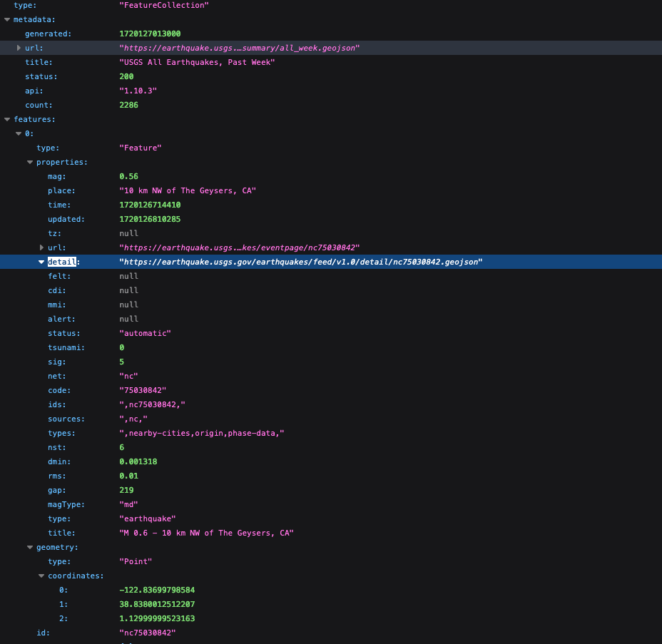
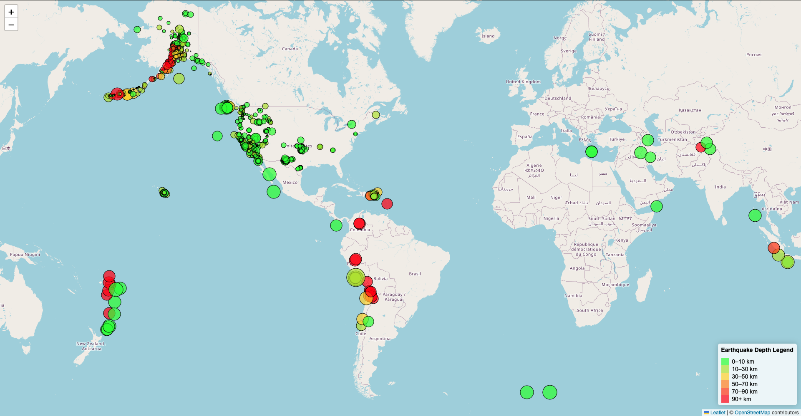

# leaflet-challenge

This is the Leaflet Earthquake Visualization Github Repo. The data used for visualization came from the United States Geological Survey (USGS). The goal is to generate interactive maps using Leaflet.

Background
The USGS is tasked with gathering and providing scientific data related to natural hazards, ecosystem, environmental health as well as data related to impacts of climate and land utility changes. In order to achieve and communicate effectively there is interest to build new tools for earthquake visualization data. 

Repo Organization
The repo has several files that needed to create necessary visualizations. The files includes:
1. index.html: The main HTML document.
2. LeafLet-part-1/static
   js/logic.js: This has javascript code for fetching data and use that data to build vizualization.
   CSS/style.css: This has styling information for nicer vizualization
   Images: This has screenshots of images for the README.
   

Instruction
The project is divided into two parts
1. part 1 deals with creating Earthquake Visualization
2. part 2 deals with gathering and plotting more data (optional for challenge)

Part 1: Create the Earthquake Visualization
The first activity was to visuzaliza an earthquake dataset following these steps

1. Data Acquisition 
The USGS gather data and stored different data types and in different format. The data get updated after every five minutes. The site was visited and data for the past 7 days ("All Earthquakes from the Past 7 Days" ) was select to be used for visualization.

GeoJSON Sampleimage in image folder shows the summary page up page visitation. The URL directed to "All Earthquakes from the Past 7 Days" was used to pull the data in JSON format as shown image part_7_Days_Json image as shown below.

Using Leaflet, a map was initialize to create map that shows all the earthquakes from the data. The map is based on longitude and latitude of place with earthquakes.

1. Subsequently data markers were impose on the map to show the magnitude of the earthquake using marker sizes and depth by color. Earthquakes with higher magnitudes appear larger, and earthquakes with greater depth appear darker in color.

2. When Hovering over map the marker will display a tooltip with the earthquake magnitude, location, and depth.

3. Popups were included to provide additional information about the earthquake when its associated marker is clicked.

4. A legend was added for easy of reading and understanding

   

Example of the map visualization: Part 1 Visualization
Part 2: Gather and Plot More Data (Optional)
Note: This part was not completed and will be completed at a later date.
